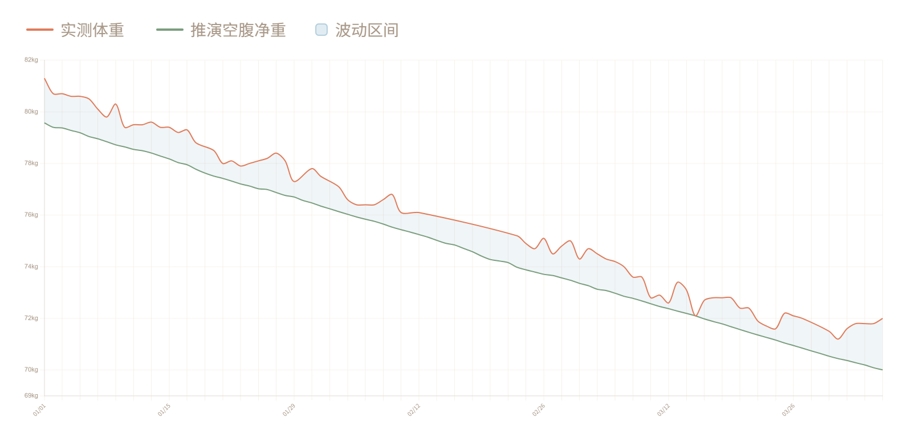
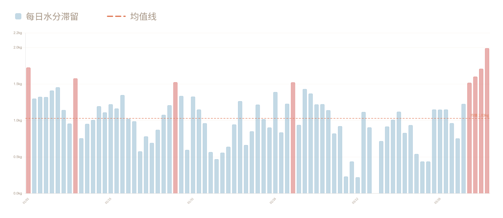

**太长不看版 · 三句话结论**

> 1. 你每天看到的体重，平均有将近1kg是假的（水分+消化道内容物）
> 2. 减脂周期中有41%的时间，体重秤会让你看起来像是"停滞了"——但身体从未停止蜕变
> 3. 打败焦虑的不是毅力，是记录

---
我差点被自己的体重秤PUA了。

你有没有经历过这种时刻——

认认真真吃少了、动多了，结果第二天，第三、第四早上踩上秤，
数字纹丝不动，甚至还涨了0.3kg。

那一刻你开始怀疑的，不是方法，是自己。

"是不是我的体质特殊？"
"是不是这次真的到瓶颈了？"
"要不要干脆放弃……"

就在最近，我又经历了一次——连续15天，
秤上的数字在同一个区间反复横跳。

直到某天早上，上完厕所后踩上去——70.9 → 69.8。

1.1kg体重显然不是那天消失的。
体重一直在降低，只是秤在骗你。

---

## 先说结论：你看到的体重，不等于你真正的身体变化

在95天的完整数据里：

**表象体重：** 81.3kg → 72.0kg（**−9.3kg**）

**推演空腹净重：** 79.6kg → 70.0kg（**−9.6kg**）

**每日"假体重"最大值：** 1.99kg

这意味着：你站上体重秤看到的数字
几乎每一天都混杂着水分、消化道内容物、糖原结合水的噪音。

看单日数字做决策，你在跟噪音较劲，不是跟趋势对话。

---

## 01｜同一个人，会有两条体重曲线

一条是你每天看到的"实测体重"——波动明显，时涨时跌。
一条是按能量缺口推演出的"空腹净重"——几乎每天都在稳定下降。

你焦虑的"没降""反弹"，大多数时候只是第一条曲线在抖动，
第二条从未停止。

---

## 02｜平台期，很多时候是你的眼睛在骗你

95天里，我按统一标准识别出6段"伪平台期"，
合计约39天——占整个周期的**41%**。

也就是说：**减脂周期中近一半的时间，体重秤会让你看起来像停滞了——但身体从未停止蜕变。**

这6段时间，秤上的数字几乎没动，
但真实净重累计下降了**3.97kg**。

**01/10–01/17（7天）**
秤上变化 ↓0.10kg · 真实净重 ↓0.69kg · 最高水分滞留 +1.35kg

**01/21–01/28（7天）**
秤上变化 ↑0.10kg · 真实净重 ↓0.66kg · 最高水分滞留 +1.53kg

**01/29–02/03（5天）**
秤上变化 ↓0.20kg · 真实净重 ↓0.57kg · 最高水分滞留 +1.33kg

**02/27–03/05（6天）**
秤上变化 ↓0.20kg · 真实净重 ↓0.58kg · 最高水分滞留 +1.52kg

**03/15–03/22（7天）**
秤上变化 ↓0.20kg · 真实净重 ↓0.74kg · 最高水分滞留 +1.12kg

**03/23–03/30（7天）**
秤上变化 ↓0.20kg · 真实净重 ↓0.73kg · 最高水分滞留 +1.15kg

> 放弃，常常发生在"数字看起来不动"的时候——
> 而不是"身体真的停止变化"的时候。

---

## 03｜每天都有将近1kg的"假体重"

"急性体重波动" = 实测体重 − 推演空腹净重。
它的来源：水钠潴留、消化道内容物、糖原结合水分——
没有一克是脂肪。

**95天数据：**
平均波动 0.99kg · 最大波动 1.99kg · 标准差 0.38kg

换句话说：你每天踩上去的数字，
平均有1kg是身体的"临时库存"，不是你的真实状态。

---

## 95天后，我得到的3个反直觉真相

**真相1：体重秤在系统性"误导"你**

除个别校准点外，日常称重几乎都含有显著噪音。
把单日数字当信号，你大概率在对着随机波动做反应。

**真相2：很多平台期是错觉，不是失败**

在你最想放弃的时段，身体往往仍在稳定减脂。
放弃发生在"数据看起来不动"，而不是"身体真的不变"。

**真相3：记录本身就是最强的工具**

记录越连续，模型越稳定，你对身体的判断越接近真实。
你的行动就不再依赖情绪，而是依赖趋势。

---

## 5个让体重秤少骗你的可执行习惯

**① 固定条件称重**
同一时间、空腹、排便后——减少变量，数据才有可比性，条件不一样的数据仅供参考即可。

**② 每餐记录摄入**
不追求完美，先追求连续。连续7天的粗略记录，
远比断断续续的精确记录更有价值。

**③ 看7日均值，不看单日数字**
单日体重是噪音，7日均值才是信号。

**④ 维持温和热量缺口**
建议不超过500kcal/日。过度节食会引发更强的水分滞留反应
反而让秤上的数字更难看。如有需要，请咨询营养师或医疗机构。

**⑤ 体重不动时，先查水分，再怀疑自己**
前几天吃咸了？睡眠不好？生理期前后？
这些都会带来1kg以上的水分波动，与脂肪无关。

---

## 写在最后

我知道"每餐记录"这四个字听起来有多反人类。

算热量、查配料表、搜索食物数据库——
大多数人坚持不过三天，不是因为不自律，
而是因为这件事本来就不应该这么麻烦。

这也是我做「Diet & Keep」AI营养师的原因。

你不需要算数字，只需要在饭前饭后拍一拍照片，
热量估算、营养缺口、趋势分析，交给AI来做。
剩下的——你只管吃，AI帮你看着。

**我自己用它记录了120天，减了13.3kg。**
每天都是外卖，没撸铁没有氧没做饭，久坐开发。

减脂不是和体重秤较劲，而是和热量缺口做朋友。
当你把身体当作一个可观测系统，
焦虑会逐步被确定性替代。

**点击阅读原文，体验AI营养师**
拍一张食物照片，开始你的第一天记录。

---

*数据来源：作者本人真实记录，工具：AI Diet & Keep*

*本文不构成医疗建议，个体差异真实存在*